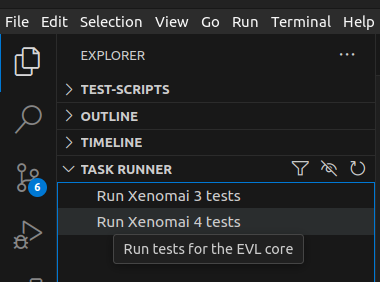

# Xenomai Torizon OS Tests

Tests that sanity check Xenomai status on Torizon OS.

## Running Tests

To download and execute tests at once:

```bash
sh -c "$(curl -sSL https://raw.githubusercontent.com/leograba/xenomai-torizon-tests/refs/heads/main/xenomai-torizon-tests.sh)"
```

## Running Tests From Local Repo

This is useful while developing the scripts.

### From VS Code ###

Run the tests from VS Code (`Ctrl + Shift + B` or use the [task runner](https://marketplace.visualstudio.com/items?itemName=microhobby.taskrunnercodeplus)):



### From the Terminal ###

Run the tests from the command-line.

```bash
./deploy.sh
```
